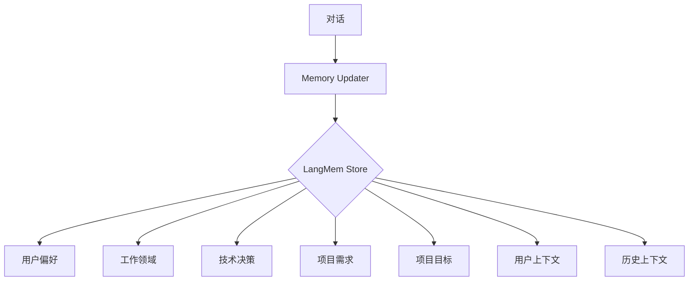
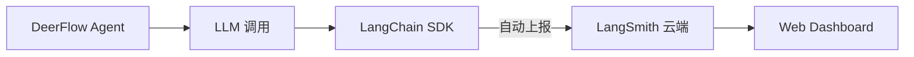

# 🦌 DeerFlow 架构深度拆解

> 本文档从源码层面完整拆解 DeerFlow 的智能体编排技术、Agent 编写逻辑、编排机制和设计哲学。
> 适用读者：想深入理解 DeerFlow 并做二次开发的开发者。

---

## 目录

1. [总体架构](#1-总体架构)
2. [Agent 系统](#2-agent-系统)
3. [Lead Agent 机制](#3-lead-agent-机制)
4. [Sub-Agent 编排](#4-sub-agent-编排)
5. [Tool 系统](#5-tool-系统)
6. [Skill 系统](#6-skill-系统)
7. [Sandbox 沙箱](#7-sandbox-沙箱)
8. [Memory 记忆系统](#8-memory-记忆系统)
9. [Model 模型接入](#9-model-模型接入)
10. [Runtime 运行时](#10-runtime-运行时)
11. [Gateway API](#11-gateway-api)
12. [技能开发指南](#12-技能开发指南)

---

## 1. 总体架构

### 目录结构

```
deer-flow/
├── backend/
│   ├── app/gateway/           ← FastAPI 网关（HTTP API + LangGraph Runtime）
│   ├── deerflow/              ← 核心 Harness 包
│   │   ├── agents/            ← Agent 定义
│   │   │   └── lead_agent/    ← 主 Agent（编排入口）
│   │   ├── subagents/         ← 子 Agent 系统
│   │   ├── tools/             ← 工具系统
│   │   ├── skills/            ← 技能系统
│   │   ├── sandbox/           ← 沙箱执行环境
│   │   ├── memory/            ← 记忆系统
│   │   ├── models/            ← 模型接入
│   │   ├── runtime/           ← LangGraph 运行时
│   │   ├── persistence/       ← 持久化层
│   │   ├── community/         ← 社区工具（搜索、图片等）
│   │   ├── config/            ← 配置解析
│   │   ├── mcp/               ← MCP 协议支持
│   │   └── uploads/           ← 文件上传
│   └── packages/harness/      ← 可安装的 Harness 包
├── frontend/
│   ├── src/app/               ← Next.js 路由
│   │   ├── workspace/         ← 工作区页面
│   │   └── ...
│   ├── src/components/        ← UI 组件
│   └── src/core/              ← 前端核心逻辑
├── skills/                    ← 内置技能
│   └── public/                ← 公开技能包
└── config.yaml                ← 主配置文件
```

### 数据流

```
用户输入
    │
    ▼
┌──────────────────────┐
│   Gateway (FastAPI)   │  ← 接收 HTTP/SSE 请求
│   AuthMiddleware      │  ← JWT 认证
│   LangGraph Runtime   │  ← LangGraph 驱动
└──────┬───────────────┘
       │
       ▼
┌──────────────────────┐
│   Lead Agent         │  ← 主 Agent（LangGraph 图）
│   ├── 理解意图        │
│   ├── 选择工具/Skill  │
│   └── 编排 Sub-Agent  │
└──────┬───────────────┘
       │
       ▼
┌──────────────────────┐
│   LLM Model          │  ← 调用大模型
│   Tools              │  ← 执行工具
│   Sandbox            │  ← 沙箱环境
│   Memory             │  ← 读写记忆
└──────────────────────┘
```

---

## 2. Agent 系统

### 2.1 核心概念

DeerFlow 的 Agent 系统基于 **LangGraph** 构建。LangGraph 是 LangChain 推出的有状态图框架，允许将 Agent 定义为有向图（DAG），节点是函数/LLM 调用，边是状态转换。

**关键词：**

| 概念 | 说明 |
|------|------|
| **State** | 图的状态对象，在图节点之间传递 |
| **Node** | 图中的节点，每个节点是一个异步函数 |
| **Edge** | 节点之间的连接，决定执行顺序 |
| **Conditional Edge** | 条件边，根据状态决定走哪条路径 |
| **Checkpoint** | 状态快照，支持暂停/恢复 |

### 2.2 Agent 数据结构

```python
# deerflow/agents/lead_agent/agent.py

# State 定义 — 在图节点之间传递的数据对象
class AgentState(TypedDict):
    messages: list[BaseMessage]     # 消息历史
    context: dict                    # 上下文（agent_name, thinking_enabled 等）
    is_plan_mode: bool               # 是否计划模式
    deep_research_exhausted: bool    # 深度研究是否已用完
    training_data: list | None       # Agent 训练数据（memory）
    memory_updated: bool             # 记忆是否已更新
```

### 2.3 图定义

Lead Agent 是一个 LangGraph `StateGraph`，包含多个节点：

```python
# 简化的图结构
graph = StateGraph(AgentState)

# 节点注册
graph.add_node("call_model", call_model_node)        # 调用 LLM
graph.add_node("call_tool", call_tool_node)          # 执行工具
graph.add_node("memory_agent", memory_agent_node)    # 更新记忆

# 边定义
graph.add_conditional_edges(
    "call_model",
    should_continue,              # 条件函数：判断是否还有工具调用
    {"continue": "call_tool", "end": "__end__"}
)
graph.add_edge("call_tool", "call_model")  # 工具执行完后回到 LLM
```

**这个图的核心循环：**

```
call_model (LLM 思考)
    │
    ├── 如果 LLM 返回了 tool_calls → call_tool
    │       │
    │       └── 执行完工具 → 回到 call_model
    │
    └── 如果 LLM 返回了最终答案 → __end__
```

### 2.4 Agent 运行时

Agent 通过 LangGraph 的 `compile()` 编译为可执行图：

```python
# 编译图
agent = graph.compile(
    checkpointer=checkpointer,     # 状态检查点（支持中断/恢复）
    interrupt_before=[],           # 在哪些节点前中断
    interrupt_after=[],            # 在哪些节点后中断
)

# 执行
result = await agent.ainvoke(
    input={"messages": [user_message]},
    config={"configurable": {"thread_id": thread_id}},
)
```

---

## 3. Lead Agent 机制

### 3.1 总体流程

Lead Agent 是 DeerFlow 的核心编排器。文件位于 `agents/lead_agent/agent.py`（447 行）+ `agents/lead_agent/prompt.py`（906 行）。

**处理流程：**

```
用户消息
    │
    ▼
1. 构建 System Prompt
   ├── 加载 config 中的模型配置
   ├── 注入工具列表（tools）
   ├── 注入技能（skills）
   ├── 注入记忆（memory）
   ├── 注入上下文（agent_name, user_id 等）
   └── 注入 SOUL.md（Agent 人格）
    │
    ▼
2. Call Model（调用 LLM）
   ├── 创建 ChatModel 实例
   ├── 绑定工具（bind_tools）
   ├── 设置参数（temperature, max_tokens 等）
   └── 调用 LLM（流式或非流式）
    │
    ▼
3. Should Continue（判断下一步）
   ├── LLM 返回了 tool_calls → 去 call_tool
   ├── LLM 返回了最终答案 → 结束
   └── LLM 返回了空内容 → 去 memory_agent
    │
    ▼
4. Call Tool（执行工具）
   ├── 解析 tool_call
   ├── 检查权限/护栏
   ├── 执行工具函数
   └── 将结果放入 messages
    │
    ▼
5. Memory Agent（更新记忆）
   ├── 从对话中提取关键信息
   └── 更新 memory.json
```

### 3.2 System Prompt 构建

System Prompt 是 Agent 行为的核心。DeerFlow 动态构建 System Prompt：

```python
# prompt.py 中的核心函数
def get_system_prompt(config, user_context, tools, skills) -> str:
    parts = []

    # 1. 角色定义
    parts.append(get_role_prompt())

    # 2. 工具列表
    parts.append(get_tools_prompt(tools))

    # 3. 技能描述
    parts.append(get_skills_prompt(skills))

    # 4. 记忆上下文
    parts.append(get_memory_prompt(user_context))

    # 5. SOUL.md（Agent 人格）
    parts.append(get_soul_prompt(user_context))

    # 6. 规则约束
    parts.append(get_rules_prompt())

    return "\n\n".join(parts)
```

### 3.3 关键代码分析

```python
# agents/lead_agent/agent.py — 核心执行函数

async def call_model_node(state: AgentState, config: RunnableConfig):
    """LLM 调用节点 — Agent 的"大脑" """

    # 1. 构建消息列表
    messages = state["messages"]

    # 2. 获取绑定了工具的 LLM
    runtime = config["configurable"]["runtime"]
    llm = runtime.get_chat_model()

    # 3. 注入 Agent 上下文
    llm = llm.bind_tools(tools)

    # 4. 调用 LLM
    response = await llm.ainvoke(messages)

    # 5. 返回新的消息
    return {"messages": [response]}
```

---

## 4. Sub-Agent 编排

### 4.1 Sub-Agent 机制

DeerFlow 支持 Lead Agent 创建子 Agent 来并行/串行执行任务。这是其"超级 Agent Harness"的核心能力。

```python
# subagents/executor.py

class SubAgentExecutor:
    """子 Agent 执行器"""

    async def execute(self, task: SubTask) -> SubTaskResult:
        # 1. 为子 Agent 创建独立的 LangGraph 图
        # 2. 配置独立的 LLM 和工具集
        # 3. 执行任务并收集结果
        # 4. 将结果返回给 Lead Agent
```

### 4.2 Sub-Agent 执行流程

```
Lead Agent
    │
    ├── 分析复杂任务
    ├── 拆分为子任务
    ├── 创建 Sub-Agent（每个一个独立的 LangGraph 实例）
    │
    ├── 模式 1：串行执行
    │   SubAgent1 → SubAgent2 → SubAgent3
    │
    ├── 模式 2：并行执行
    │   SubAgent1 ──┐
    │   SubAgent2 ──┤── 合并结果
    │   SubAgent3 ──┘
    │
    └── 收集子任务结果 → 汇总输出
```

### 4.3 Sub-Agent 配置

```yaml
# config.yaml 中的 subagent 配置
subagents:
  enabled: true
  max_concurrency: 3        # 最大并行数
  default_timeout: 300      # 默认超时（秒）
```

---

## 5. Tool 系统

### 5.1 Tool 注册机制

DeerFlow 的 Tool 通过 `tools/tools.py` 中的 `get_available_tools()` 函数动态加载：

```python
# tools/tools.py

def get_available_tools(
    groups: list[str] | None = None,
    model_name: str | None = None,
    app_config: AppConfig | None = None,
) -> list[BaseTool]:
    """从 config 中读取 tool 配置，动态加载"""

    # 1. 从 config.yaml 读取 tools 列表
    config = app_config or load_config()
    tool_configs = config.tools

    # 2. 过滤 tool group
    if groups:
        tool_configs = [t for t in tool_configs if t.group in groups]

    # 3. 动态加载每个 tool
    tools = []
    for tc in tool_configs:
        # resolve_variable 通过字符串路径加载 Python 对象
        tool_class = resolve_variable(tc.use, BaseTool)
        tool_instance = tool_class()
        tools.append(tool_instance)

    return tools
```

### 5.2 Tool 配置格式

```yaml
# config.yaml
tools:
  - name: web_search
    group: web
    use: deerflow.community.ddg_search.tools:web_search_tool
    max_results: 5

  - name: create_plan
    group: plan
    use: deerflow.plans.tools:create_plan
```

`use` 字段的格式是 `package.module:function_or_class`，通过 `resolve_variable()` 动态解析：

```python
def resolve_variable(use_path: str, expected_type: type) -> Any:
    """解析 'module.submodule:object' 格式的路径"""
    module_path, obj_name = use_path.split(":", 1)
    module = importlib.import_module(module_path)
    return getattr(module, obj_name)
```

### 5.3 内置工具类型

| 工具 | 用途 | 源码位置 |
|------|------|---------|
| `web_search` | DuckDuckGo 搜索 | `community/ddg_search/tools.py` |
| `web_fetch` | Jina AI 网页抓取 | `community/jina_ai/tools.py` |
| `image_search` | 图片搜索 | `community/image_search/tools.py` |
| `bash` | 执行 Shell 命令 | `sandbox/tools.py` |
| `read_file` | 读取文件 | `sandbox/tools.py` |
| `write_file` | 写入文件 | `sandbox/tools.py` |
| `create_plan` | 创建计划 | `plans/tools.py` |
| `present_file` | 展示文件 | `tools/builtins/present_file_tool.py` |

---

## 6. Skill 系统

### 6.1 Skill 是什么

Skill 是 DeerFlow 的"技能包"——一个包含完整指令的 `.skill` ZIP 文件（本质是一个目录），里面包含：

```
my-skill.skill/
├── SKILL.md          ← 技能定义（必选）
├── scripts/          ← 脚本（可选）
├── templates/        ← 模板（可选）
├── references/       ← 参考文件（可选）
└── evals/            ← 评估数据（可选）
```

### 6.2 SKILL.md 结构

每个 Skill 的核心是 `SKILL.md`，使用 YAML front-matter + Markdown：

```markdown
---
name: my-skill
description: 当用户请求 X 时使用此技能。触发词：Y、Z。
---

# My Skill

## Overview
此技能的作用是...

## Workflow
### Step 1: 理解需求
- 识别用户输入
- 确定需要的数据

### Step 2: 执行
- 写代码/查资料/生成内容

### Step 3: 输出
- 格式化结果
- 保存到 /mnt/user-data/outputs/
```

### 6.3 Skill 加载机制

```python
# skills/parser.py — 解析 SKILL.md

def parse_skill(skill_dir: Path) -> Skill:
    """解析 skill 目录，提取元数据和指令"""

    skill_file = skill_dir / "SKILL.md"
    with open(skill_file) as f:
        content = f.read()

    # 解析 YAML front-matter
    _, front_matter, body = content.split("---", 2)
    meta = yaml.safe_load(front_matter)

    return Skill(
        name=meta["name"],
        description=meta["description"],
        instructions=body.strip(),
        scripts_dir=skill_dir / "scripts",
        templates_dir=skill_dir / "templates",
    )
```

### 6.4 Skill 注入到 System Prompt

Skill 的 description 被注入到 System Prompt 中，LLM 根据匹配度决定是否调用。这是关键的触发机制：

```python
# 在 system prompt 中注入技能描述
skills_section = "## Available Skills\n\n"
for skill in available_skills:
    skills_section += f"- {skill.name}: {skill.description}\n"
```

当用户说"分析这个数据"时，LLM 匹配到 `data-analysis` 的 description，就会按照 SKILL.md 中的步骤执行。

---

## 7. Sandbox 沙箱

### 7.1 Local Sandbox（默认）

```python
# sandbox/local/provider.py

class LocalSandboxProvider:
    """本地沙箱 — 直接在当前进程执行"""

    async def execute(self, command: str) -> SandboxResult:
        """在本地执行命令"""
        proc = await asyncio.create_subprocess_shell(
            command,
            stdout=asyncio.subprocess.PIPE,
            stderr=asyncio.subprocess.PIPE,
        )
        stdout, stderr = await proc.communicate()
        return SandboxResult(
            stdout=stdout.decode(),
            stderr=stderr.decode(),
            exit_code=proc.returncode,
        )
```

### 7.2 Container Sandbox（Docker）

```python
# community/aio_sandbox/

class AioSandboxProvider:
    """容器沙箱 — 在 Docker 容器中隔离执行"""

    async def execute(self, command: str) -> SandboxResult:
        """在隔离容器中执行命令"""
        container = await self._get_or_create_container()
        result = await container.exec_run(command)
        return SandboxResult(
            stdout=result.output.decode(),
            stderr="",
            exit_code=result.exit_code,
        )
```

---

## 8. Memory 记忆系统

### 8.1 架构概览

DeerFlow 的记忆系统已升级为 **LangMem**——基于 LangGraph Store 的结构化记忆系统，支持分类管理、置信度评分和完整 CRUD API。



### 8.2 记忆分类

LangMem 将记忆分为 **5 种预设分类**：

| 分类 | 说明 | 示例 |
|------|------|------|
| **用户偏好** | 用户的语言、风格偏好 | "用户偏好中文回复、简洁风格" |
| **工作领域** | 用户职业和行业 | "用户是 AI 产品经理" |
| **技术决策** | 技术选型和架构决策 | "用户选择 Python + FastAPI 技术栈" |
| **项目需求** | 项目功能需求 | "项目需要实现自动化报表功能" |
| **项目目标** | 项目目标和里程碑 | "Q3 目标：完成 MVP 上线" |

每条记忆还包含：
- **置信度**（0-1）：Agent 对该信息的确信程度
- **来源**：记录该记忆的对话 ID
- **时间戳**：创建和更新时间

### 8.3 API 接口

```
记忆管理：
  GET    /api/memory                 → 获取完整记忆结构
  GET    /api/memory/langmem         → 列出记忆（分页）
  POST   /api/memory/langmem         → 创建记忆事实
  PUT    /api/memory/langmem/{id}    → 更新记忆
  DELETE /api/memory/langmem/{id}    → 删除记忆
  POST   /api/memory/import          → 导入记忆
  DELETE /api/memory                 → 清空所有记忆
```

### 8.4 前端页面

访问 `/workspace/memory` 可管理所有记忆，支持：
- 按分类筛选
- 搜索记忆内容
- 新建/编辑/删除记忆
- 查看置信度和来源

### 8.5 与旧版 JSON 记忆的对比

| 特性 | 旧版 JSON Memory | LangMem |
|------|------------------|---------|
| 存储后端 | `memory.json` 文件 | LangGraph Store |
| 分类 | 无 | 5 种预设分类 |
| 置信度 | 无 | 0-1 评分 |
| 作用域 | 全局/用户/Agent | 用户级 |
| 版本控制 | 无 | 每次更新记录时间戳 |
| API | 无专用 API | 完整 REST CRUD |
| 前端管理 | 无 | `/workspace/memory` 管理页面 |

---

## 9. Model 模型接入

### 9.1 模型配置

```yaml
# config.yaml
models:
  - name: deepseek-v4-flash
    display_name: DeepSeek V4 Flash
    use: deerflow.models.patched_deepseek:PatchedChatDeepSeek
    model: deepseek-v4-flash
    api_key: $DEEPSEEK_API_KEY
    supports_thinking: true
    when_thinking_enabled:
      extra_body:
        thinking:
          type: enabled
```

### 9.2 模型加载机制

```python
# models/factory.py

def create_chat_model(model_config: ModelConfig) -> BaseChatModel:
    """根据配置创建 ChatModel 实例"""

    # 1. 解析 use 路径
    model_class = resolve_variable(model_config.use)

    # 2. 构建参数字典
    kwargs = {
        "model": model_config.model,
        "api_key": model_config.api_key,
        "timeout": model_config.timeout,
    }

    # 3. 添加可选参数
    if model_config.base_url:
        kwargs["base_url"] = model_config.base_url
    if model_config.max_tokens:
        kwargs["max_tokens"] = model_config.max_tokens
    if model_config.temperature:
        kwargs["temperature"] = model_config.temperature

    # 4. 实例化
    return model_class(**kwargs)
```

### 9.3 Thinking 模式

DeerFlow 对支持思考链的模型（如 DeepSeek R1、Claude）有特殊处理：

```python
# models/patched_deepseek.py

class PatchedChatDeepSeek(ChatDeepSeek):
    """修复多轮对话中 reasoning_content 丢失的问题"""

    def _convert_message_to_dict(self, message):
        """确保 reasoning_content 在消息中正确传递"""
        d = super()._convert_message_to_dict(message)
        if hasattr(message, "reasoning_content"):
            d["reasoning_content"] = message.reasoning_content
        return d
```

---

## 10. Runtime 运行时

### 10.1 LangGraph Runtime

```python
# runtime/ 目录结构
runtime/
├── __init__.py
├── checkpointer/    ← 状态检查点
├── events/          ← 事件系统
│   └── store/       ← 事件存储
├── runs/            ← 运行管理
│   └── store/       ← 运行记录存储
├── store/           ← 通用存储
└── stream_bridge/   ← SSE 流式传输
```

### 10.2 流式传输

```python
# runtime/stream_bridge/stream_bridge.py

class StreamBridge:
    """将 LangGraph 的事件流转换为 SSE"""

    async def stream_events(self, thread_id: str, input: dict):
        """流式传输 Agent 执行事件"""

        async for event in self.agent.astream_events(input):
            # 事件类型：
            # on_chat_model_start  — LLM 开始思考
            # on_chat_model_end    — LLM 思考完成
            # on_tool_start        — 工具开始执行
            # on_tool_end          — 工具执行完成

            sse_event = self._convert_to_sse(event)
            yield sse_event
```

---

## 11. 外部集成

### 11.1 LangSmith 可观测性

**LangSmith 不是 DeerFlow 的内置功能**，而是 LangChain 推出的外部 LLM 可观测性平台。
DeerFlow 支持将 LLM 调用日志转发到 LangSmith 以追踪和分析。

当前服务器配置：
```bash
LANGSMITH_TRACING=true           # 启用追踪
LANGSMITH_API_KEY=your-langsmith-api-key  # API 密钥
LANGSMITH_PROJECT=deerflow       # 项目名称
LANGSMITH_ENDPOINT=https://api.smith.langchain.com
```

追踪内容会在每次 LLM 调用时自动发送到 LangSmith 云端，通过 https://smith.langchain.com 查看。



### 11.3 Gateway API

### 11.3.1 API 结构

```
/api/
├── v1/auth/          ← 认证
├── threads/          ← 对话线程 CRUD
├── threads/{id}/runs ← 运行管理
├── threads/{id}/artifacts ← 文件制品
├── threads/{id}/uploads   ← 文件上传
├── models           ← 模型列表
├── memory           ← 记忆管理
├── skills           ← 技能管理
├── agents           ← 智能体管理
└── plans            ← 计划任务
```

### 11.2 认证中间件

```python
# auth_middleware.py

class AuthMiddleware(BaseHTTPMiddleware):
    """JWT 认证中间件 — 保护所有 /api/* 路由"""

    async def dispatch(self, request, call_next):
        # 公开路径免认证
        if _is_public(request.url.path):
            return await call_next(request)

        # 检查 JWT Cookie
        token = request.cookies.get("access_token")
        if not token:
            return JSONResponse(status_code=401, ...)

        # 验证 JWT
        user = await decode_token(token)
        request.state.user = user

        return await call_next(request)
```

---

## 12. 技能开发指南

### 12.1 如何编写一个 Skill

Skill 是 DeerFlow 的扩展方式。创建一个技能只需三步：

**步骤 1：创建目录结构**

```bash
skills/custom/my-skill/
├── SKILL.md
└── scripts/
    └── run.py
```

**步骤 2：编写 SKILL.md**

```markdown
---
name: my-skill
description: >
  当用户请求执行 X 操作时使用此技能。
  触发词：X、Y、Z。
  不适用于 A、B 情况。
---

# My Skill

## Overview
此技能的作用是...

## Workflow
### Step 1: 理解需求
- 识别用户输入中的关键参数

### Step 2: 执行
- 使用 bash_tool 运行脚本

### Step 3: 输出
- 结果保存到 /mnt/user-data/outputs/
- 使用 present_file 展示结果
```

**步骤 3：注册到 config.yaml**

```yaml
skills:
  directories:
    - ./skills/public
    - ./skills/custom
```

### 12.2 编写最佳实践

| 原则 | 说明 |
|------|------|
| **精准描述** | description 决定了 Skill 的触发准确率，要包含触发词 |
| **步骤清晰** | Workflow 要足够详细，让 LLM 能按步骤执行 |
| **结果可预测** | 指定输出格式和位置，让系统能正确展示 |
| **最小权限** | 只给 Skill 必要的工具访问权限 |
| **可测试** | 提供 evals/ 评估数据 |

### 12.3 常用开发模式

**模式 1：数据分析型**
```
用户上传文件 → data-analysis 读取 → pandas 处理 → 输出结果
```

**模式 2：研究型**
```
用户提问 → deep-research 搜索 → 多角度分析 → 整理报告
```

**模式 3：生成型**
```
用户需求 → ppt-generation 规划 → image-generation 配图 → 合成输出
```

---

## 核心设计哲学

1. **一切皆工具**：所有能力都用 Tool 封装，LLM 通过 Tool Calling 选择使用
2. **Skill 驱动**：复杂能力通过 Skill 注入 System Prompt，而非硬编码
3. **无状态 API**：状态由 LangGraph 管理，API 层保持无状态
4. **插件化加载**：所有组件（Model、Tool、Sandbox）都通过 `use:` 路径动态加载

```
config.yaml → 动态解析 → 组件实例化 → 注入 Agent → 执行
```

这种设计让 DeerFlow 具有极高的可扩展性——添加一个新能力不需要改核心代码，只需要：

1. 写一个 Python 函数（Tool）
2. 在 config.yaml 中添加一行
3. 可选：写一个 SKILL.md 让 LLM 知道怎么用

---

> 本文档由 DeerFlow 源码分析生成，对应 `feat/file-tree-panel` 分支的最新代码。
> 核心源码位置：`backend/packages/harness/deerflow/`

---

## 附录：当前系统实际配置

> ⚠️ **注意**：以下内容基于你当前服务器的实际配置，可能与默认 DeerFlow 不同。

### A. LangMem 记忆系统

**当前系统运行的是升级版的记忆系统 —— LangMem。**

与旧版简单 JSON 记忆不同，LangMem 提供了结构化的记忆管理：

```
记忆分类：
├── 用户偏好    → 语言、风格偏好
├── 工作领域    → 职业、行业相关信息
├── 技术决策    → 技术选型、架构决策
├── 项目需求    → 项目功能需求
└── 项目目标    → 项目目标和里程碑
```

**API 接口：**
```
GET    /api/memory/langmem?offset=0&limit=50  → 列出记忆
POST   /api/memory/langmem                     → 创建记忆
PUT    /api/memory/langmem/{id}                → 更新记忆
DELETE /api/memory/langmem/{id}                → 删除记忆
GET    /api/memory                             → 获取完整记忆
POST   /api/memory/import                      → 导入记忆
DELETE /api/memory                             → 清空记忆
```

**前端页面：** `/workspace/memory` — 记忆管理器，支持分类查看、搜索、编辑、删除

**与旧版 JSON 记忆的区别：**

| 特性 | 旧版 Memory | LangMem |
|------|------------|---------|
| 存储方式 | JSON 文件 | LangGraph Store |
| 分类 | 无分类 | 5 种预设分类 |
| 置信度 | 无 | 0-1 置信度评分 |
| 关联 Agent | 每个 Agent 独立 | 用户级全局 |
| UI 管理 | 无 | 完整管理页面 |

### B. LangSmith 追踪

**当前系统已配置 LangSmith 用于 LLM 调用追踪。**

配置（`.env`）：
```
LANGSMITH_TRACING=true
LANGSMITH_API_KEY=your-langsmith-api-key
LANGSMITH_PROJECT=deerflow
LANGSMITH_ENDPOINT=https://api.smith.langchain.com
```

LangSmith 追踪的内容：
- 每次 LLM 调用的输入/输出
- Tool 调用链
- Token 消耗统计
- 调用耗时
- Agent 思考过程

访问 https://smith.langchain.com → 选择 deerflow 项目即可查看。

### C. 计划任务系统

**当前系统已集成计划任务管理。**

```
Agent Tools:
  - create_plan(title, due_date, priority)   → 创建计划
  - list_plans(status)                        → 列出计划
  - complete_plan(plan_id)                    → 完成计划
  - delete_plan(plan_id)                      → 删除计划

API:
  GET /api/plans → 获取所有计划（供前端日历展示）

存储:
  计划数据存储在 memory.json 的 __plans__ 字段
```

### D. 文件目录树

**当前系统在聊天页面左侧添加了文件目录树侧边栏。**

- 点击顶部栏 📁 图标切换
- 显示对话线程中的文件（从磁盘读取，不依赖 artifacts 列表）
- 目录树可直接点击文件在右侧预览
- 支持拖拽调整宽度

功能分布：
```
frontend/
├── src/components/workspace/artifacts/
│   ├── file-tree-panel.tsx     ← 目录树 UI 组件
│   ├── file-tree-trigger.tsx   ← 顶部栏切换按钮
│   └── file-tree.ts            ← 树结构算法

backend/
├── app/gateway/routers/artifacts.py
│   └── GET /api/threads/{id}/files/tree  ← 文件树 API
└── packages/harness/deerflow/plans/
    ├── store.py                ← 计划存储
    └── tools.py                ← Agent 工具
```
