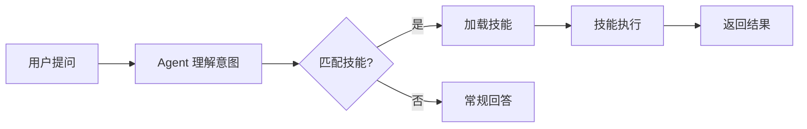

# 🦌 DeerFlow 内置技能完整指南

> DeerFlow 内置了 21 个即开即用的技能（Skills），覆盖学术研究、数据分析和内容创作等多个领域。
> 每个技能是一个独立的 `.skill` 包，Agent 会根据你的需求自动加载，也可以手动安装。

## 技能调用方式

**DeerFlow 的技能是"按需自动调用"的**——你不需要手动指定用哪个技能，只需要表达你的需求，Agent 会自动判断并加载最合适的技能。

### 自动触发规则

每个技能在 `SKILL.md` 中定义了触发条件（description 字段），Agent 会根据你的问题语义匹配：

```
你的问题 → Agent 理解意图 → 匹配技能描述 → 自动加载技能
```

例如：
- 你说"分析这个 Excel 文件" → 自动触发 `data-analysis`
- 你说"帮我搜索 Transformer 的最新论文" → 自动触发 `deep-research`
- 你说"画个图表展示这些数据" → 自动触发 `chart-visualization`

### 手动触发

| 方式 | 说明 |
|------|------|
| **明确指定** | 直接说"用 deep-research 技能研究..." |
| **查找技能** | 说"find a skill for [你的需求]" 会自动触发 `find-skills` |
| **安装新技能** | Agent 找到合适技能后会询问是否安装 |

### 技能加载流程



---

## 技能分类总览

### 📚 学术与研究
| 技能 | 说明 | 适合场景 |
|------|------|---------|
| [deep-research](#8-深度研究-deep-research) | 多角度深度网络研究 | 查信息、做研究 |
| [academic-paper-review](#1-学术论文评审-academic-paper-review) | 单篇论文评审 | 审阅论文 PDF/URL |
| [systematic-literature-review](#18-系统性文献综述-systematic-literature-review) | 多篇论文系统综述 | 文献综述、参考书目 |

### 📊 数据分析
| 技能 | 说明 | 适合场景 |
|------|------|---------|
| [data-analysis](#7-数据分析-data-analysis) | Excel/CSV 数据分析 | 上传文件分析 |
| [chart-visualization](#3-图表可视化-chart-visualization) | 26 种图表生成 | 数据可视化 |

### 💼 商业与咨询
| 技能 | 说明 | 适合场景 |
|------|------|---------|
| [consulting-analysis](#6-咨询分析报告-consulting-analysis) | 专业咨询报告 | 市场/行业分析 |
| [newsletter-generation](#13-新闻通讯生成-newsletter-generation) | 新闻通讯生成 | 周报、摘要 |

### 💻 开发与设计
| 技能 | 说明 | 适合场景 |
|------|------|---------|
| [code-documentation](#5-代码文档生成-code-documentation) | 代码文档生成 | README、API 文档 |
| [frontend-design](#10-前端界面设计-frontend-design) | 前端界面设计 | 网站、组件 |
| [github-deep-research](#11-github-深度研究-github-deep-research) | GitHub 仓库分析 | 开源项目研究 |
| [web-design-guidelines](#21-web-设计规范检查-web-design-guidelines) | UI 规范审查 | 可访问性检查 |
| [vercel-deploy-claimable](#19-vercel-部署-vercel-deploy-claimable) | Vercel 部署 | 一键部署 |

### 🎨 创意与内容
| 技能 | 说明 | 适合场景 |
|------|------|---------|
| [image-generation](#12-图片生成-image-generation) | AI 图片生成 | 设计图、插画 |
| [video-generation](#20-视频生成-video-generation) | AI 视频生成 | 短视频 |
| [ppt-generation](#15-ppt-生成-ppt-generation) | PPT 生成 | 演示文稿 |
| [podcast-generation](#14-播客生成-podcast-generation) | 播客生成 | 文本转音频 |

### 🔧 系统与元技能
| 技能 | 说明 | 适合场景 |
|------|------|---------|
| [skill-creator](#16-技能创建器-skill-creator) | 创建自定义技能 | 扩展现有能力 |
| [find-skills](#9-技能发现-find-skills) | 发现新技能 | 寻找合适技能 |
| [bootstrap](#2-引导与初始化-bootstrap) | 新手引导 | 首次使用 |
| [claude-to-deerflow](#4-claude--deerflow-互操作-claude-to-deerflow) | 跨平台协作 | Claude ↔ DeerFlow |
| [surprise-me](#17-惊喜展示-surprise-me) | 创意组合展示 | 娱乐探索 |

---

## 1. 学术论文评审 (academic-paper-review)

### 功能描述

对学术论文、研究文章、预印本进行结构化、同行评议级别的分析评审。遵循 NeurIPS、ICML、ACL、Nature、IEEE 等顶级期刊/会议的评审标准。

### 适用场景

- 审阅论文：提供 URL（arXiv、DOI）、上传 PDF
- 请求评审、分析、总结论文
- 需要方法论评估、贡献评价、文献定位分析

### 核心能力

- **结构化评审**：摘要、优势、劣势、方法论评估、贡献评价
- **文献定位**：通过定向文献搜索将论文定位到更广泛的研究图景
- **方法论评估**：实验设计、统计有效性、可复现性评估
- **多格式输出**：详细评审 + 简洁执行摘要两种格式
- **跨学科支持**：计算机科学、生物学、物理学、社会科学等

### 使用技巧

- 提供 PDF URL 比上传文件效果更好（Agent 可以直接分析全文）
- 可以要求聚焦特定方面："重点看方法论"
- 支持多篇对比："帮我比较这两篇论文的贡献"

---

## 2. 引导与初始化 (bootstrap)

### 功能描述

帮助新用户快速上手 DeerFlow，在用户的 SOUL.md 文件中记录个性化偏好配置。

### 适用场景

- 首次使用 DeerFlow 时引导对话
- 想设置助手偏好：语言、风格、专业领域
- 想了解 DeerFlow 的能力边界

### 使用技巧

- 首次使用会自动触发引导流程
- 可以随时说"重新引导我"来修改配置
- 配置内容会自动写入 SOUL.md 持久化

---

## 3. 图表可视化 (chart-visualization)

### 功能描述

将数据智能地转换为可视化图表。从 **26 种图表类型**中自动选择最合适的一种，生成 JavaScript 渲染的图表图片。

### 适用场景

- "可视化这些数据"、"画个图表"
- 展示数据趋势、分布、对比
- 数据分析报告配图

### 支持的图表类型（部分）

| 类型 | 用途 |
|------|------|
| 柱状图 / 折线图 | 趋势展示与分类对比 |
| 饼图 / 环形图 | 占比展示 |
| 散点图 / 气泡图 | 相关性分析 |
| 热力图 / 雷达图 | 多维数据 |
| 桑基图 / 漏斗图 | 流量与转化 |
| 鱼骨图 / 流程图 | 因果与流程分析 |
| 地图 / 词云 | 地理与文本数据 |

### 使用技巧

- 提供结构化数据（CSV/JSON/表格）比文字描述更精确
- 可以指定图表类型："画一个柱状图对比各季度销售额"
- 图表会渲染为图片，可直接在对话中查看

---

## 4. Claude ↔ DeerFlow 互操作 (claude-to-deerflow)

### 功能描述

通过 HTTP API 与 DeerFlow AI Agent 平台交互，允许 Claude 或其他 Agent 调用 DeerFlow 进行深度研究。

### 适用场景

- 当前对话中需要 DeerFlow 的深度研究能力
- 启动、管理 DeerFlow 对话线程
- 查询可用模型/技能/智能体列表
- 委托复杂研究任务给 DeerFlow

### 核心能力

- 创建和管理 DeerFlow 对话线程
- 发送消息并获取回复
- 查询模型、技能、智能体列表
- 管理记忆系统、上传文件

### 使用技巧

- 这是 Claude Code 与 DeerFlow 之间的桥梁
- Claude 负责编码和逻辑推理，DeerFlow 负责深度研究

---

## 5. 代码文档生成 (code-documentation)

### 功能描述

为代码、API、库、仓库或软件项目生成专业文档。

### 适用场景

- 生成 README、API 参考文档、开发者指南
- 添加行内代码注释
- 生成 CHANGELOG、架构文档

### 核心能力

| 文档类型 | 说明 |
|---------|------|
| README | 项目简介、安装、使用、贡献 |
| API 参考 | 端点、参数、返回值、示例 |
| 代码注释 | JSDoc / Docstring |
| 架构文档 | 架构图、模块依赖 |
| 变更日志 | CHANGELOG |

### 使用技巧

- 上传整个仓库效果更好
- 可以指定风格："生成中文文档"、"用 JSDoc 格式"

---

## 6. 咨询分析报告 (consulting-analysis)

### 功能描述

生成咨询级的专业研究报告，采用两阶段工作模式。

### 工作流程


### 适用场景

- 市场分析、消费者洞察、品牌分析
- 财务分析、行业研究、竞争情报
- 投资尽职调查

### 使用技巧

- 第一阶段生成的框架可以先审核，再进入第二阶段
- 配合 deep-research 技能使用效果最佳
- 可以指定格式："McKinsey 风格报告"

---

## 7. 数据分析 (data-analysis)

### 功能描述

对 Excel（.xlsx/.xls）或 CSV 文件进行全面的数据分析。

### 适用场景

- 上传文件进行分析
- 数据统计、汇总、透视表
- 数据清洗和转换

### 核心能力

- 多 Sheet 支持
- 数据聚合、过滤、排序
- 透视表生成
- 多表 JOIN 查询
- CSV / JSON / Markdown 导出

### 使用技巧

- 上传后直接问："这个月的销售额趋势如何？"
- 可以要求导出："把结果导出为 CSV"

---

## 8. 深度研究 (deep-research)

### 功能描述

**最常用的技能**。对任何需要网络研究的问题进行系统性的多角度研究。

### 适用场景

- **替代所有常规搜索**：任何需要联网信息的问题
- "what is X"、"research X"、"compare X and Y"
- 在内容生成任务之前自动触发

### 核心能力

- 多轮自动搜索获取全面信息
- 多角度分析问题
- 多信源交叉验证
- 结构化研究报告输出

### 使用技巧

- **这是最常用的技能**——任何需要查信息的问题优先用它
- 研究范围可以指定："深度研究 AI 芯片市场，重点看 NVIDIA 和华为"
- 结果质量比单次搜索高得多

---

## 9. 技能发现 (find-skills)

### 功能描述

帮助用户发现和安装 Agent 技能。当你需要某种能力时，自动搜索合适技能。

### 适用场景

- "find a skill for [需求]"
- "can you do [某件事]"
- 想扩展 Agent 能力

### 使用技巧

- 在想做某事但 Agent 不会时，先试试 "find a skill for ..."
- 技能安装后立即生效，无需重启

---

## 10. 前端界面设计 (frontend-design)

### 功能描述

创建具有高设计质量的前端界面，避免通用的 AI 审美。

### 适用场景

- 构建网站、落地页、仪表板
- 设计 React 组件、HTML/CSS 布局
- 美化 Web UI

### 特点

- 生成创意性、精良的 UI 代码
- 避免千篇一律的 AI 审美
- 支持现代前端框架

### 使用技巧

- 提供参考风格："设计一个类似 Notion 的仪表板"
- 可以迭代优化："导航栏改到左侧"

---

## 11. GitHub 深度研究 (github-deep-research)

### 功能描述

对任何 GitHub 仓库进行多轮深度研究，生成结构化 Markdown 报告。

### 适用场景

- 分析 GitHub 仓库
- 时间线重建、竞争分析
- 开源项目深度调查

### 报告内容

- 执行摘要
- 提交历史和里程碑时间线
- 指标分析（Stars、Forks、贡献者）
- Mermaid 图表可视化

### 使用技巧

- 直接提供 GitHub URL 即可
- 可以对比多个仓库

---

## 12. 图片生成 (image-generation)

### 功能描述

AI 图片生成，支持结构化提示词和参考图片。

### 适用场景

- 产品图、场景图、角色设计
- 视觉创意和概念设计

### 使用技巧

- 提示词越具体越好
- 可以提供参考图片作为风格引导
- 生成后可以继续调整

---

## 13. 新闻通讯生成 (newsletter-generation)

### 功能描述

生成新闻通讯、邮件摘要、每周汇总、行业简报。

### 适用场景

- "create a newsletter about X"
- 周报、技术简报、行业动态

### 使用技巧

- 指定目标受众调整语气
- 配合 deep-research 使用获取最新资讯

---

## 14. 播客生成 (podcast-generation)

### 功能描述

将文本内容转换为双人对话形式的播客音频。

### 适用场景

- 长文转播客
- 文章内容音频化

### 使用技巧

- 先让 deep-research 生成内容，再转播客
- 可以指定对话风格

---

## 15. PPT 生成 (ppt-generation)

### 功能描述

从文本内容生成 PowerPoint（PPTX）演示文稿，每页自动配图。

### 适用场景

- "生成一个关于 X 的演示文稿"
- "把这份研究做成 PPT"

### 使用技巧

- 先收集内容再生成 PPT
- 可以指定风格："投资风格"、"学术风格"

---

## 16. 技能创建器 (skill-creator)

### 功能描述

**DeerFlow 的"元技能"**——创建、修改、评估和优化其他技能。

### 适用场景

- 从零创建自定义技能
- 编辑已有技能
- 运行评估测试
- 优化技能触发描述

### 核心能力

- 创建 .skill 包
- 运行 eval 集测试
- 基准测试 + 方差分析

### 使用技巧

- 这是 DeerFlow 最强大的技能之一
- 创建好技能的关键：好的 description（触发）+ 清晰的步骤（逻辑）

---

## 17. 惊喜展示 (surprise-me)

### 功能描述

动态组合已启用的技能，创造意想不到的创意输出。

### 适用场景

- "surprise me" / "show me something interesting"
- 创意探索和展示

---

## 18. 系统性文献综述 (systematic-literature-review)

### 功能描述

跨多篇论文进行系统性综述，支持 APA、IEEE、BibTeX 格式输出。

### 适用场景

- **与 academic-paper-review 的区别**：本技能综述多篇论文，后者深入评审单篇
- 文献综述、带注释的参考书目
- 跨论文比较

### 使用技巧

- 可以指定搜索范围和时间
- 支持三种引用格式

---

## 19. Vercel 部署 (vercel-deploy-claimable)

### 功能描述

将应用和网站部署到 Vercel，无需认证。

### 适用场景

- "Deploy my app"
- 快速分享和预览

### 注意

- 生成可认领的部署链接，请尽快认领

---

## 20. 视频生成 (video-generation)

### 功能描述

AI 视频生成，支持结构化提示词和参考图片。

### 适用场景

- 短视频生成
- 视觉内容创作

---

## 21. Web 设计规范检查 (web-design-guidelines)

### 功能描述

审查 UI 代码是否符合设计规范和可访问性标准。

### 检查项

- WCAG 可访问性规范
- 设计一致性
- UX 最佳实践
- 响应式适配
- 性能建议

### 使用技巧

- 提供代码或 URL 均可审查
- 审查后会提供具体修复建议

---

## 安装与配置

### 自动加载

技能目录已默认配置在 `config.yaml` 中：
```yaml
skills:
  directories:
    - ./skills/public
```

### 安装社区技能

在对话中说 "find a skill for [需求]" 即可搜索和安装社区技能。

### 创建自定义技能

使用 `skill-creator` 技能从零创建，或直接编辑 `skills/custom/` 目录下的 `.skill` 文件。
